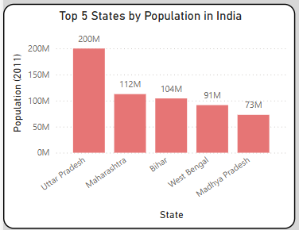
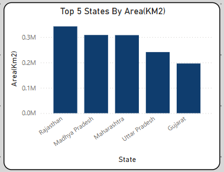

# Territorial and Census Overview of India: Power BI Data Analysis Project

## 1. Project Overview

This project demonstrates an end-to-end data analysis workflow using **Power BI**, starting from **web data extraction** to creating **insightful visualizations**. The primary goal was to extract information about the **States and Union Territories of India** from a Wikipedia page, transform it, and then build an **interactive dashboard** to answer key demographic and geographical questions.

### Tools Used:
- **Data Source**: Wikipedia (Web Scraping)
- **Data Transformation & Modeling**: Power BI Desktop (Power Query Editor)
- **Data Visualization & Analysis**: Power BI Desktop

---

## 2. Data Source

The data for this project was sourced from the following Wikipedia page:  
🔗 [States and Union Territories of India – Wikipedia](https://en.wikipedia.org/wiki/States_and_union_territories_of_India)

Specifically, the table containing the list of States and Union Territories, along with their **population**, **area**, **capital**, and other relevant details, was extracted for analysis.

---

## 3. Data Extraction & Transformation (Power Query)

### Get Data from Web:
1. In Power BI Desktop, go to **Home > Get Data > Web**.
2. Paste the Wikipedia URL:  
   `https://en.wikipedia.org/wiki/States_and_union_territories_of_India`
3. In the Navigator window, select Table 5

### Initial Data Inspection:
- Review the loaded data for headers, irrelevant columns, and quality issues.

### Key Transformation Steps:
- **Rename Columns** for clarity:  
  Example: `"State/UT"` → `"State_UT"`,  
  `"Population(2011)[27][28]"` → `"Population_2011"`,  
- **Change Data Types**:
  - `Population_2011`: Text -> Whole Number
  - `Area_Km2`: Text -> Whole Number 
### Load & Apply:
- After transformations, load the data using **Home > Close & Apply**.

---

## 4. Dashboard Design & Visualizations
 - This section showcases the various visualizations created to answer the project's key questions. Each visualization is accompanied by a brief explanation of its purpose and the insights it provides.

### 4.0. Full Dashboard Overview
- **Purpose**: Overview of the complete dashboard layout.
  

---

### 4.1. Top 5 States by Population
- **Type**: Stacked Column Chart  
- **Purpose**: Show the most populous States from 2011 census  
- **Config**: `State` on Y-Axis, `Population_2011` on Y-Axis, with Top N filter  
 

---

### 4.2. Top 5 States by Area (Km²)
- **Type**: Stacked Column Chart 
- **Purpose**: Show the largest States by area (Km²)
- **Config**: `State` on Y-Axis, `Area(Km2)` on Y-Axis, with Top N filter

---

### 4.3. States with Least Population
- **Type**:  Stacked Column Chart
- **Purpose**: Highlight least populated States
- **Config**:`State` on Y-Axis, `Population_2011` on Y-Axis, sorted in ascending order -> Applied Top N filter -> Show Items by Bottom 5 

---

### 4.4. States with Smallest Area
- **Type**: Stacked Column Chart 
- **Purpose**: Highlight smallest geographical areas  
- **Config**:  **Config**:`State` on Y-Axis, `Area(Km2)` on Y-Axis, sorted in ascending order -> Applied Top N filter -> Show Items by Bottom 5 

---

### 4.5. Languages Spoken in India (Share)
- **Type**: Donut Chart  
- **Purpose**: Show language diversity in India  
- **Note**: Derived from available or external data
- **Config**: `officiallanguages` on Legend, `officiallanguages` on Values

---

### 4.6. Population By Zone (Tree Map)
- **Type**: Tree Map  
- **Purpose**: Visualize population by zones (North, South, etc.)  
- **Config**: `Zone` on Category, `Population_2011` on Values  

---

## 5. Key Findings and Insights

- **Population Distribution**: Clear view of highly and sparsely populated regions
- **Geographical Spread**: Understand regional size differences
- **Zonal Patterns**: Population clustering by geographical zone
- **Language Diversity**: Emphasizes India’s multilingual society

---

## 6. Conclusion & Future Enhancements

This project successfully demonstrated the process of extracting, transforming, and visualizing data in Power BI to derive meaningful insights about the States of India.

### Potential Enhancements:

- Integrate more recent population data (e.g., estimated current population).
- Add data on GDP per capita, literacy rates, or other socio-economic indicators for a richer analysis.
- Incorporate geographical mapping visuals to display states on an actual map.
- Create more interactive elements, such as slicers for year selection (if historical data is added) or zone filtering.
- Publish the dashboard to Power BI Service for sharing and collaboration.

---

> ✨ _Thank you for exploring this project!_  
> 📌 *Feel free to fork, modify, or contribute via pull request on GitHub.*
